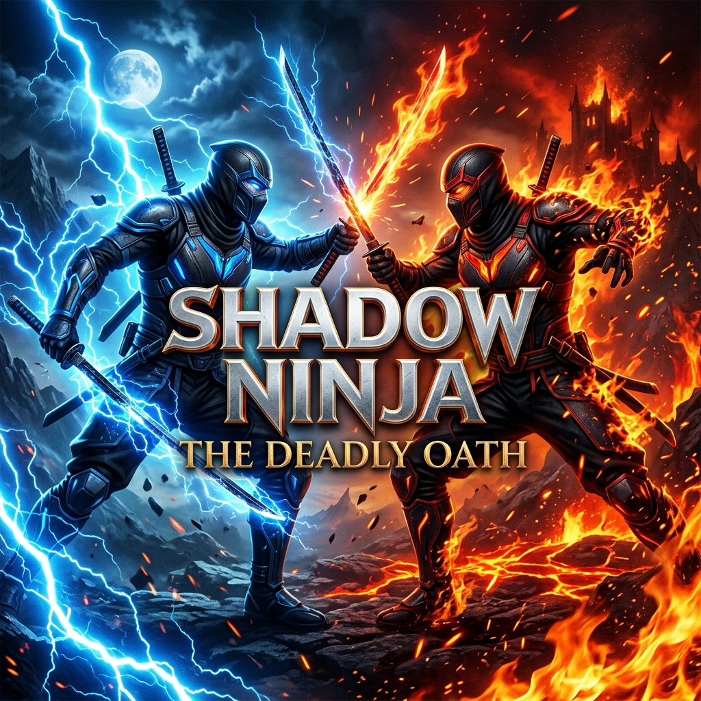

# Shadow Ninja: The Deadly Oath



## 🥷 Overview
**Shadow Ninja: The Deadly Oath** is a high-octane, action-packed ninja combat game. Step into the shadows and embark on a perilous journey to fulfill a deadly oath. Master the arts of stealth, speed, and lethal combat as you face off against formidable foes in a world of fire and lightning.

## ✨ Features
- **Dynamic Combat System**: Engage in fluid, fast-paced battles with a variety of moves and finishers.
- **Elemental Powers**: Harness the power of Blue Lightning and Scorching Fire to devastate your enemies.
- **Stunning Visuals**: Experience a cinematic world brought to life with high-quality assets and atmospheric lighting.
- **Epic Boss Fights**: Challenge powerful guardians and prove your mastery of the ninja arts.
- **Intricate Level Design**: Navigate through dangerous environments filled with secrets and traps.

## 🎮 Controls
| Action | Key |
|--------|-----|
| Move | `WASD` or `Arrow Keys` |
| Jump | `Space` |
| Attack | `Left Click` / `J` |
| Special Ability | `Right Click` / `K` |
| Dash | `Shift` / `L` |
| Pause | `Esc` |

## 🛠️ Installation
1. **Clone the repository**:
   ```bash
   git clone https://github.com/ayesha-devx/shadow-ninja-the-deadly-oath.git
   ```
2. **Open in Unity**:
   - Open Unity Hub.
   - Click "Add" and select the cloned project folder.
   - Use Unity Version **2021.3+** (LTS recommended).
3. **Run the Game**:
   - Open the `MainScene` located in `Assets/Scenes/`.
   - Press the **Play** button.

## 📜 Credits
Developed by **Ayesha** and team.
Built with **Unity Engine**.

---
*May your blade be sharp and your shadows deep.*
